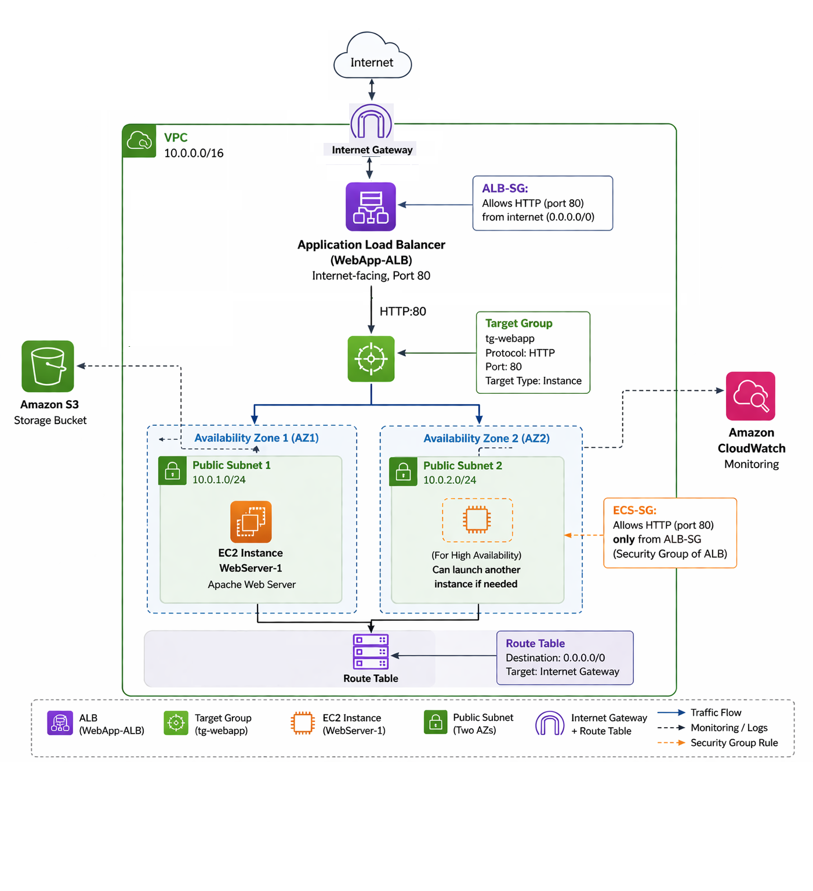

# aws-web-application-deployment
AWS web application using EC2, ALB, S3, and CloudWatch

AWS Web Application Deployment
Overview

This project implements a complete AWS-based web application deployment using core cloud infrastructure services. The objective was to design and deploy a functional, secure, and highly available architecture while understanding how individual AWS components integrate into a unified system.

The application is hosted on an Amazon EC2 instance and accessed through an Application Load Balancer (ALB). The environment is deployed within a custom Virtual Private Cloud (VPC) and incorporates supporting services such as Amazon S3 for storage and Amazon CloudWatch for monitoring.

Architecture Diagram

Architecture Overview

The system follows a layered request flow:

Internet → Internet Gateway → Application Load Balancer → Target Group → EC2 Instance

Incoming HTTP traffic enters through the Internet Gateway, is received by the Application Load Balancer, and is routed through a target group to the EC2 instance running the web server.

The Application Load Balancer is deployed across two public subnets located in separate Availability Zones. This ensures that traffic can continue to be served even if one zone becomes unavailable.

Access control is enforced using security groups:

ALB-SG allows inbound HTTP (port 80) traffic from the internet
ECS-SG allows inbound HTTP traffic only from ALB-SG

This configuration prevents direct public access to the EC2 instance and ensures all traffic is filtered through the load balancer.

Infrastructure Components
Networking
VPC: 10.0.0.0/16
Public Subnet 1 (AZ1)
Public Subnet 2 (AZ2)
Internet Gateway attached to the VPC
Route Table configured to allow internet connectivity

The networking layer provides isolation and controlled routing between resources.

Compute
Amazon EC2 (t3.micro) instance
Amazon Linux operating system
Apache Web Server installed and configured

The EC2 instance hosts the application and responds to incoming HTTP requests.

Load Balancing
Application Load Balancer (WebApp-ALB)
Listener configured on HTTP (port 80)
Target Group (tg-webapp) associated with EC2 instance

The load balancer distributes traffic and routes requests to the backend instance.

Security
ALB-SG
Allows inbound HTTP traffic from any source
ECS-SG
Allows inbound HTTP traffic only from ALB-SG

This layered approach ensures that backend resources are not directly exposed.

Storage
Amazon S3

Used as a storage service external to the application’s main request path.

Monitoring
Amazon CloudWatch

Used to monitor EC2 performance metrics such as CPU utilization.

Deployment Summary

The deployment was completed in the following sequence:

Created a custom VPC with CIDR block 10.0.0.0/16
Created two public subnets across separate Availability Zones
Attached an Internet Gateway
Configured route tables for internet access
Created and configured security groups
Launched an EC2 (t3.micro) instance and installed Apache
Created a target group and registered the EC2 instance
Created an Application Load Balancer across both subnets
Configured listener rules to forward traffic
Verified the deployment through browser access
Integrated S3 and CloudWatch
Security Design

Security is enforced through controlled access:

The Application Load Balancer is the only publicly accessible component
The EC2 instance is isolated and not directly reachable from the internet
All inbound traffic is routed through the ALB

This reduces exposure and enforces proper access boundaries.

High Availability
Deployment spans two Availability Zones
The ALB distributes traffic across both subnets
The architecture supports scaling by adding additional EC2 instances

This design improves reliability and fault tolerance.

Monitoring

Amazon CloudWatch provides visibility into system performance:

Tracks CPU utilization of the EC2 instance
Supports monitoring and troubleshooting
Screenshots

All deployment verification screenshots are located in the screenshots/ directory.

These include:

VPC configuration
Subnets across two Availability Zones
Internet Gateway
Route table configuration
Security group rules
Load balancer setup
Target group configuration and health status
EC2 instance details
CloudWatch metrics
Application output

Result

The application was successfully deployed and validated.

Accessing the system through the load balancer returns the web page hosted on the EC2 instance, confirming that the full request flow and system integration are functioning correctly.
